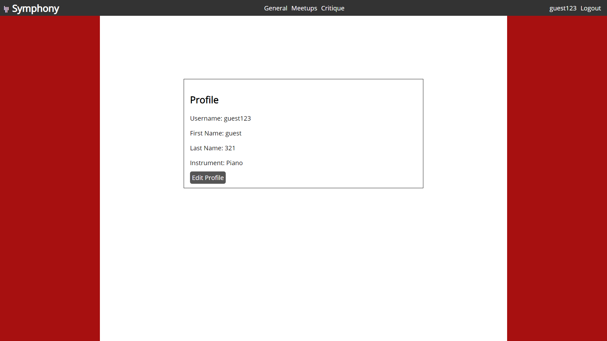

# Symphony
 Discussion forum for classical musicians or those aspiring

Link to live page:  https://symphony-forum.herokuapp.com/

## Motivation
I wanted to make a medium through which classical musicians can discuss and help one another. I learned to
play the viola when I was younger, and I think I would have enjoyed it more if I had friends to learn with. 

## Screenshots
Home Page:

Signup Page: 
 

Login Page:
 

Discussion Page:

Comment Edit/Delete:

Profile Page: 

Profile Edit Page: 

## Technology Used:
### Front-End:
    1. HTML
    2. CSS
    3. JavaScript

### Back-end: 
    1. Node.js
    2. Express
    3. Mongo

